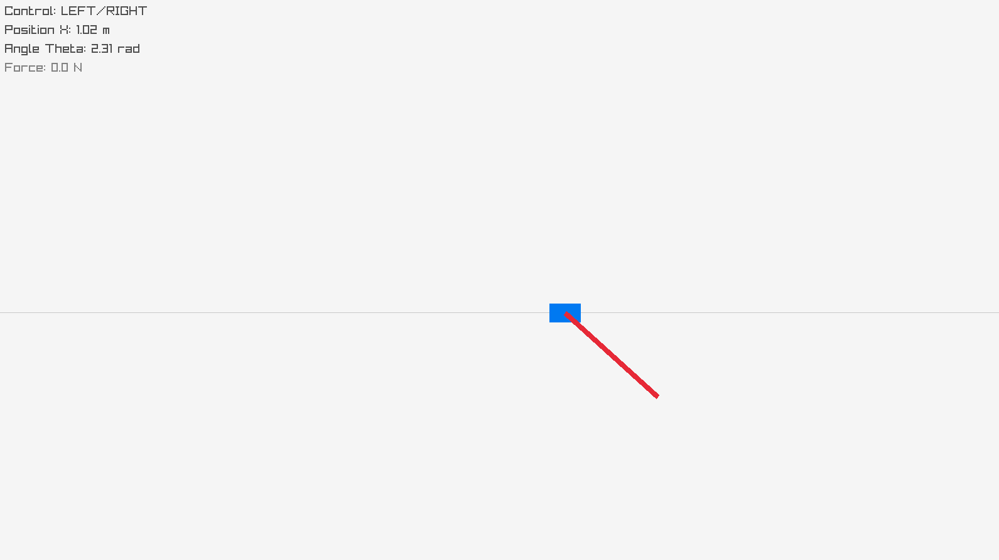

# Inverted Pendulum (CartPole)

This repository contains a C implementation of an inverted pendulum/cartpole game and a reinforcement learning training pipeline in Python using a custom C physics backend.



## Project structure

- `c_engine/`: C physics and game source code.
- `python_rl/`: Python reinforcement learning environment, training, and policy playback.
- `build/`: compiled binaries and shared library.
- `models/`: trained RL models.

## Requirements

### C game

- `gcc`
- `raylib` development libraries
- Linux desktop environment for rendering

### Python training and playback

- `python3`
- `pip`
- `gymnasium`
- `stable_baselines3`
- `pygame`
- `numpy`

## Build and run the C game

1. Build the game:

```bash
make game
```

2. Run the game:

```bash
./build/cartpole_game
```

3. Controls:

- Left arrow: apply force left
- Right arrow: apply force right

## Build the shared C physics library for Python

The Python RL environment loads `build/libcartpole.so`, so compile it before running training or playback.

```bash
make lib
```

## Train the RL algorithm

1. Install Python dependencies.

```bash
python3 -m pip install --upgrade pip
python3 -m pip install gymnasium stable-baselines3 pygame numpy
```

2. Build the shared library:

```bash
make lib
```

3. Run training:

```bash
cd python_rl
python3 train.py
```

The agent is saved to `models/ppo_cartpole.zip`.

## Run the trained policy

After training, play back the trained agent:

```bash
cd python_rl
python3 play_policy.py
```

The environment uses `pygame` to render the cart and pole while the loaded PPO policy controls the cart.

## Clean build artifacts

```bash
make clean
```

## Notes

- The training script uses a custom `CartPoleCustomEnv` backed by the C physics engine.
- The game and the RL environment are separate: the game is a manual interactive demo in C, while the RL training uses Python to learn an agent with the same physics.
